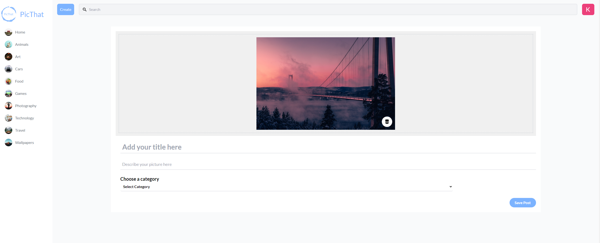
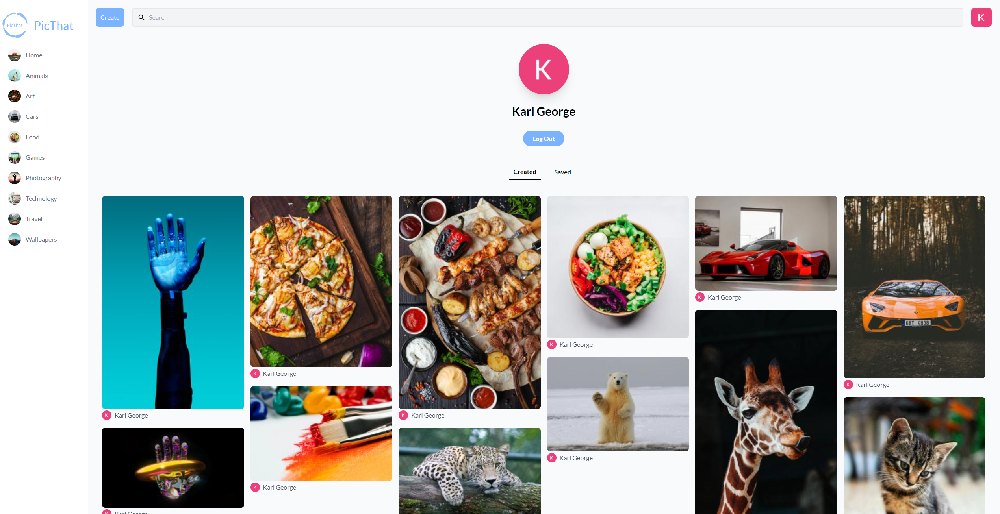
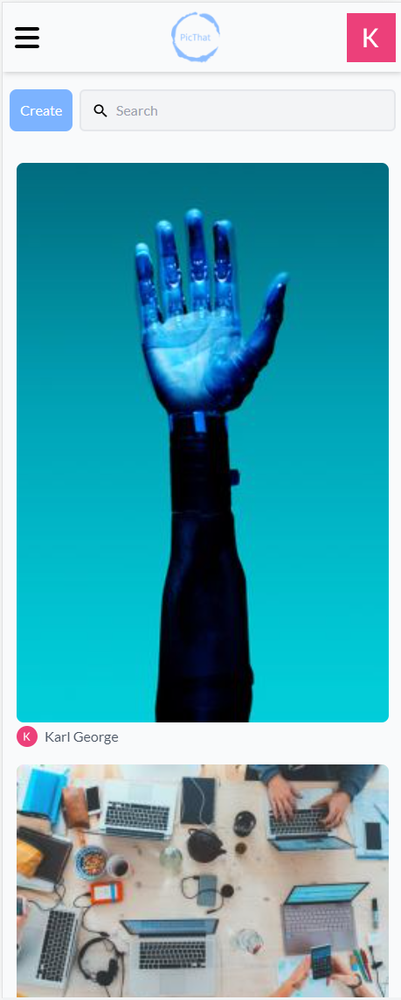
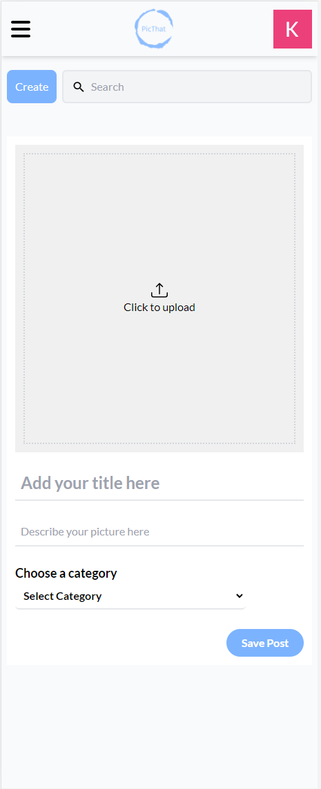
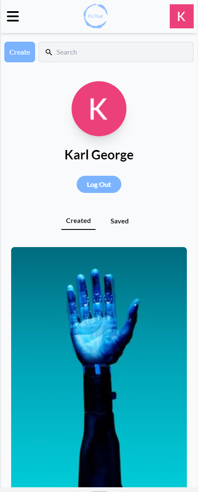

# PicThat Social Media Platform

A social media image sharing platform that allows users to sign in with their google account aswell as upload, favourite, download and search images and gifs uploaded by themselves and other users.

Developed using Sanity, React and Tailwind CSS.

[View site live](https://picthat.netlify.app/)

## Install Dependencies

Use `npm install` to install any required dependencies.

## Preview

### Desktop

### Mobile

